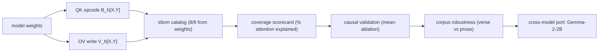
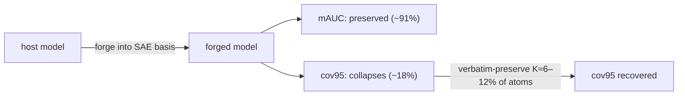

# Paper kit — a short NEMI-workshop paper from this repo

This document is a **self-contained kit**: an agent with LaTeX, matplotlib, and web access
should be able to write a short (4–6 page) workshop paper from it without re-deriving anything.
Every quantitative claim points to the exact `runs/*_summary.json` it comes from (all tracked),
so figures and tables can be regenerated. Numbers below are the committed results.

The repo holds **two related contributions** that can be one paper or two:
- **(A) The cov95 forge tax + preserve-verbatim lever**, generalized from `bio-sae` to a
  language model (§Results A).
- **(B) Disassembling attention as a causally-validated, cross-model instruction set**
  (§Results B). For a NEMI submission, **(B) is the stronger standalone paper** (novel,
  self-contained, two models, causal); (A) is a strong "results" or appendix thread. Pick the
  framing in the abstract; both share §Methods and §Reproducibility.

---

## Suggested title / abstract (B-framing)

**Title:** *Attention is a small instruction set: a causally-validated, cross-model op-catalog
of what sparse autoencoders miss.*

**Abstract (draft).** Sparse autoencoders (SAEs) recover a model's *features* but not its
*composition*. We make this concrete by **re-expressing a model's weights so that its residual
stream is written in a fixed SAE feature basis** — yielding a runnable model that computes in
feature coordinates (we call this *forging* the model). Forging preserves predictive accuracy
(mean best-latent detection AUC) yet collapses single-latent monosemanticity (the fraction of
known features each detectable by one latent at AUC≥0.95): SAE features survive as readouts but
the computation over them does not factor through them. We argue the composition is nonetheless
legible in a *different* basis. Reading attention as QK/OV bilinears over an operand basis, we
assemble a catalog of weight-grounded **idioms** (induction, previous-token, duplicate,
name-mover families, copy-suppression, S-inhibition), quantify the fraction of attention it
explains, and show the named operators are **causally load-bearing** (mean-ablation;
induction-NLL z=8.6) and **corpus-robust** (head identities ρ≈0.84 across verse and prose). We
then port the entire reading to three more architectures — **Gemma-2-2B, Llama-3.2-1B, and
Qwen2.5-1.5B** (RoPE/GQA/RMSNorm) — and find the mechanisms are **architecture-invariant**
(induction is causally load-bearing in all four, mean-ablation z=8.3–27.3) and the plumbing
*fraction* is invariant (~87%), but its *composition* is not: the attention-sink is high
(44–55%) in GPT-2, Llama, and Qwen, while **Gemma-2 is a low-sink (~4%) outlier**.
Most of attention is positional plumbing; the content-carrying minority is largely named,
causal, and shared across models.

### Alternative title / abstract (C-framing — the cross-model decompilation program)

**Title:** *Necessity isn't sufficiency: named circuits are distributed, and how distributed tracks scale (a
six-model decompilation study).*

**Abstract (draft).** Mechanistic interpretability names *necessary* components — heads whose ablation hurts. We test
**sufficiency** across six transformers (GPT-2 small/medium/large, Gemma-2-2B, Llama-3.2-1B, Qwen2.5-1.5B): keeping
only a named circuit's heads and ablating the rest. **No small head-set reconstructs induction** (≤30% even under
on-distribution resample-ablation), and **even IOI's celebrated 26-head circuit is not sufficient in isolation** — the
catalogued circuits are causally dominant but the behaviour is carried by the near-whole network. We then show that
**much of what is usually attributed to architecture (absolute-position vs RoPE) actually tracks scale**: across the
GPT-2 ladder the *same* circuits become more distributed (induction's single-prev-token-writer key-collapse decays
39→8→1%, reconstruction coverage falls, redundancy turns compensatory, the load-bearing MLP sites broaden). Porting
ROME causal tracing cross-model (it had only been run on GPT-2/GPT-J), we recover an architecture-invariant two-site
knowledge flow — an early MLP store at the subject feeding a late attention readout — and edit facts by activation
patch (100% transplant in 5/6 models; Gemma's storage is distributed). Finally, when in-context evidence contradicts
stored memory, the induction circuit is the override mechanism, with an architecture-dependent evidence threshold
(RoPE needs ≥2 occurrences; GPT-2 fires on one). Throughout, Gemma-2 is the recurring outlier and small models are
unusually localized — a caution for circuit claims read off a single small model.

> **Writing note — define the coined terms, do not assume them.** "Forge / forging / forge tax",
> "cov95", "the oracle", "operand basis", "preserve-verbatim", "U_A / U_C", and "χ" are
> **vocabulary internal to this research program**, not standard ML terms a NEMI reader will
> know. The abstract above introduces *forging* on first use; the paper must do the same for
> every coined term (or substitute a standard phrasing). The **Terminology** section below gives
> a one-line external-facing gloss for each — use it, and prefer the standard term where one
> exists (e.g. "monosemanticity recovery" over the bare metric name "cov95").

---

## Terminology (project-coined — define on first use, prefer standard phrasing)

These terms are internal to this research program. The right-hand column is the external-facing
gloss to use in the paper; **none of them should appear unexplained**.

| internal term | what to write for an external reader |
|---------------|--------------------------------------|
| **forge / forging** | re-express (project) a trained model's weights so its residual stream is written in a fixed SAE feature basis, producing a runnable model whose computation happens in feature coordinates. (Mechanism: project the host's read/write weights onto the SAE decoder directions; run with `forward_mode=native_in_basis`.) Not a standard term — define it the first time. |
| **forge tax** | the degradation caused by forging — specifically, the collapse of single-latent monosemanticity (cov95) even though predictive accuracy (mAUC) is largely preserved. Call it "the cost of forcing computation through the SAE basis," then optionally name it. |
| **cov95** | monosemanticity-recovery score = fraction of *known* (oracle) features for which **some single SAE latent** is a detector at AUC ≥ 0.95. Write "single-latent monosemanticity recovery (cov95)". |
| **mAUC** | mean over known features of the **best** single-latent detection AUC. Write "mean best-latent detection AUC (mAUC)". Standard-ish, but still gloss it. |
| **the oracle** | the exact, externally-computed ground-truth feature labels per token (token identity / lexical class / structure). Write "ground-truth feature labels" — the novelty is that they are *exact and external*, unlike a real LLM where features have no answer key. |
| **operand basis** | the set of directions (token unembeddings / per-layer token centroids, or SAE decoder rows) in which QK/OV bilinears are read; the "operands" the attention opcode binds. Gloss as "a basis of interpretable directions used as the coordinates for the QK/OV bilinear." |
| **idiom / op-catalog** | a named, weight-grounded attention behavior (induction, prev-token, …) and the catalog of them. Tie to the literature head-type names; "idiom" is our umbrella term. |
| **preserve-verbatim / preserve set / P1** | keep a chosen subset of SAE atoms as **exact host readouts** (not forged) while forging the rest. Write "verbatim-preserving a subset of features." |
| **U_A / U_C** | the two subspaces of the "two-basis forge": U_A preserves single-feature *assertions* (recovers cov95), U_C is meant to preserve *composition*/circuits. Only needed for the retraction (§6); define if used. |
| **χ (chi)** | a monosemanticity score of an entanglement "band" against the oracle (high χ = clean/monosemantic, low χ = entangled). Only needed for the entanglement-tower thread; gloss as "monosemanticity of a residual subspace." |
| **substrate** | within the program, a dataset/model with a *manufactured* known feature factorization (bio/econ/sm); for this paper just say "a model with ground-truth feature labels." |

For the **B-framing paper** (the op-catalog), only *forge / forge tax / cov95 / mAUC / operand
basis / idiom* are load-bearing; U_A·U_C and χ can be omitted entirely.

---

## Contributions (citable claims)

1. **The cov95 forge tax replicates on a language model**, with the canonical signature: mAUC
   robust, cov95 collapses, sharp one-token detectors hit hardest. *(A)*
2. **The tax is emergent, not over-completeness-driven** — collapsed at every SAE width
   including 1× — placing real LLMs in the "preserve-verbatim," not "concentrate," regime. *(A)*
3. **Preserve-verbatim is the lever**: keeping ~6–12% of atoms verbatim recovers host cov95;
   the selection provably needs a *value* signal (label-free selection is anti-informative). *(A)*
4. **A weight-grounded, causally-validated, corpus-robust op-catalog** for GPT-2 attention,
   with a coverage scorecard ("% of attention explained"). *(B)*
5. **The catalog ports across four families** (GPT-2, Gemma-2, Llama-3.2, Qwen-2.5) at matched detail;
   the idioms + induction-causality are architecture-invariant, but the attention-sink is
   family-dependent (44–55% in GPT-2/Llama/Qwen, ~4% in Gemma — Gemma the low outlier), *not*
   GPT-2-specific. *(B)*
6. **An honest retraction**: a specific two-basis "writer-output `U_C`" circuit-preservation
   claim is falsified under compression control — a methodological caution about gameable
   circuit metrics. *(both)*
7. **The op-catalog is language-universal**: on multilingual models the idiom heads are the *same* across
   six languages / four scripts (induction-head identity Spearman +0.83–0.88, prev-token +0.98) with
   near-constant attention budgets — language is operand-level, not mechanism-level. *(B)*

**From disassembly to executable decompilation (C — the cross-model program, [Results D](#results-d) below):**

8. **Necessity ≠ sufficiency — named circuits are distributed.** Keeping only a named circuit's heads (ablating the
   rest, MLPs intact) reconstructs ≤17% (mean-ablation) / ≤30% (resample, on-distribution) of induction in any of six
   models, and **even IOI's celebrated 26-head circuit is not sufficient in isolation** (negative logit-diff, no
   better than a random head-set). The catalogued circuits are causally *necessary and dominant* but the behaviour is
   carried by the near-whole network. *(C)*
9. **Much of what looks architectural tracks *scale*.** Across the GPT-2 ladder (124M→774M) the *same* named circuits
   become more distributed: induction's single-prev-token-writer key-collapse decays 39%→8%→1% (small models have one
   dominant writer; larger ones distribute it like the RoPE models), reconstruction coverage decays, redundancy turns
   compensatory, and the token-determined MLP "embedding block" and the load-bearing succession/knowledge MLP sites
   broaden and deepen. Absolute-vs-RoPE is real (the sink, positional broadcast), but small models are unusually
   *localized*. *(C)*
10. **Cross-model knowledge localization.** ROME causal tracing (subject corruption + restoration), **run across six
    models** (ROME did GPT-2/GPT-J), recovers an architecture-invariant **two-site flow** — an early MLP store at the
    subject (depth≈0) feeding a late attention readout at the last token (depth≈0.6–0.9) — and the early store is
    **editable by activation patch** (100% fact-transplant in 5/6 models; **Gemma's storage is distributed**, no band
    transplants). *(C)*
11. **Induction is the in-context-override mechanism, with an architecture-dependent threshold.** When an in-context
    statement contradicts a stored fact, ablating the induction heads swings the model back to memory; the RoPE
    family's apparent "memory-dominance" is a *one-shot* effect — at ≥2 repetitions all six models flip to 100%
    context-win (RoPE induction needs ≥2 occurrences to fire; GPT-2 fires on one). *(C)*
12. **Filled gaps and feature-space operands.** Succession (the +1 operator) is 95–100% MLP-computed in early-mid MLPs
    (GPT-2; RoPE tokenizers lack single-token numbers); MLP0 is a token-determined "extended embedding" in 5/6 models;
    per-operator SAE-feature operands (GPT-2 + Gemma) give the feature-space read + copy/suppress sign. *(C)*

> **Recurring meta-findings (state as methodological cautions):** high causal effect ≠ doing the named operation
> (Llama's most induction-causal head is an *enabler*, not an inductor); synthetic repeated-random probes can
> manufacture apparent suppression; **Gemma is the recurring outlier across seven independent measurements** — the
> single most informative third architecture. See [Cross-model findings](FINDINGS.md) and [Scaling synthesis](scaling.md).

---

## Overview diagrams (Mermaid — render on GitHub, or export for the paper)

**(B) The disassembly pipeline** — read attention from the weights, name it, score coverage, causally
test, corpus-check, then port across architectures:



**(A) The forge tax and the preserve lever** — forging keeps accuracy but taxes monosemanticity;
verbatim-preserving a small set of atoms recovers it:



---

## Background & related work

The literature has a **piecemeal list of head types** but, to our knowledge, **no complete
attention op-catalog, coverage metric, or cross-model parity check** of the kind assembled here.
Anchor citations the writer should fetch and cite:

- **QK/OV + residual-stream framing**: Elhage et al., *A Mathematical Framework for Transformer
  Circuits* (Anthropic, 2021). Our opcode `B_h[X,Y] = d_X^⊤ M_h d_Y` is their QK circuit in an
  operand basis.
- **Induction heads**: Olsson et al., *In-context Learning and Induction Heads* (2022).
- **IOI circuit** (name-movers, S-inhibition, duplicate-token, backup/negative name-movers):
  Wang et al., *Interpretability in the Wild* (2023).
- **Copy-suppression**: McDougall et al. (2023).
- **Successor heads / greater-than**: Gould et al. (2023); Hanna et al. (2023).
- **Attention-sink**: Xiao et al., *Efficient Streaming LMs with Attention Sinks* (2023) — our
  cross-model result (sink is high in GPT-2/Llama/Qwen but ~absent in Gemma-2) is a direct, citable contrast.
- **SAEs / monosemanticity**: Bricken et al. (2023); Cunningham et al. (2023). **Gemma Scope**:
  Lieberum et al. (2024) — the JumpReLU SAE suite we use as the Gemma operand basis.
- **What transformers can compute (op-set framings)**: Weiss et al. RASP (2021); Lindner et al.
  Tracr (2023); Merrill & Sabharwal TC⁰ bounds. These bound *capability*; we *measure usage*.

Differentiator sentence: *prior work names individual head types; we assemble them into a single
catalog, measure the fraction of attention they explain, causally test each, check corpus
robustness, and show the reading transfers to a second architecture.*

---

## Methods (formulas + setup)

### Models & data
- **GPT-2-small** (124M; 12L×12H, d=768, tied embeddings, learned-positional, LayerNorm).
- **Tiny GPT-2** trained from scratch (`n_embd=128`, 4L, 7.2M) for the CPU forge loop.
- **Gemma-2-2B** (26L×8H, d=2304, head_dim=256, GQA n_kv=4, RoPE, RMSNorm, attn_logit_softcap=50).
- **SAEs**: self-trained TopK; published **SAELens** GPT-2 resid SAEs
  (`jbloom/GPT2-Small-SAEs-Reformatted`); **Gemma Scope** (`gemma-scope-2b-pt-res`, JumpReLU,
  width-16k) for Gemma operands.
- **Corpora**: tinyshakespeare (verse) and WikiText-2 (prose); the cross-model coverage
  comparison uses the **same** corpus (Shakespeare) for both models.

### The oracle and cov95 / mAUC
Per token, deterministic labels in tiers (token-identity / lexical / structural). For a known
feature, **cov95** = fraction of features for which *some single SAE latent* attains detection
AUC ≥ 0.95; **mAUC** = mean best-latent AUC. cov95 measures monosemanticity (one latent ⇒ one
known feature); mAUC measures accuracy. *(`common/build_lm_bundle.py`, `forge_cov_mechanism.py`)*

### The forge & the tax
Project the host's weights into the SAE basis (saeforge `SubspaceProjector` →
`NativeModel.from_projected_weights`, `forward_mode=native_in_basis`) to get a runnable
forged model; re-score the oracle on the forged residual. The **tax** = host cov95 − forged
cov95. **Preserve-verbatim (P1)**: keep the top-K oracle-reading atoms as exact host readouts,
forge the rest, sweep K. *(`cov95_forge_tax/`, `common/preserve_hybrid_tiny.py`)*

### Attention opcodes (the core of B)
For head `h`, operand directions `d_X` (token unembeddings / per-layer token centroids, or SAE
decoder rows), folded by the pre-attention norm gain and unit-normalized:
- **QK opcode** `B_h[X,Y] = d_X^⊤ M_h d_Y`, with `M_h = W_Q^{h⊤} W_K^h / √head_dim` (GPT-2) or
  `W_Q^{h⊤} W_K^{kv(h)} / √query_pre_attn_scalar` (Gemma, GQA). Top off-diagonal entry = the
  head's content binding `X→Y`.
- **OV write channel** `V_h[X,Y] = d_X^⊤ (W_O^h W_V^{h/kv}) d_Y`; diagonal dominance
  (`mean diag − mean off-diag`) classifies **copy** vs **transform**.
- **Legibility** = Spearman ρ between `B_h` and empirical attention over operand pairs, z-scored
  against an operand-label permutation null (z>2 = legible).
- **Addressing buckets** (Gemma): per-head attention mass split into self / sink / prev /
  structural / local / long-range → dominant mode.
- **Idioms**: behavioral signatures (prev-token = Δ=1; duplicate = same-token-earlier; induction
  = token-after-prev-occurrence), z>1.5 across heads; name-mover families from OV→unembed
  diagonal dominance; IOI chain from Q-composition products.

### Gemma architecture handling (the port)
GQA expansion; RMSNorm gain-fold (`1+weight`, no mean-subtraction); and reading the **unrotated**
content-QK (R₀) so RoPE's positional modulation is a separate axis from the content binding.
The MLP catalog uses the GeGLU gate_proj (read) / down_proj (write) projected onto operands.
*(`gemma/gemma_opcode_table.py`, `disassemble_gemma.py`)*

### Causal validation
**Mean-ablate** an idiom's heads (replace their output by its corpus mean) and measure damage to
*its own* metric vs the complement vs layer-matched random heads. Metrics: **induction-NLL**
(NLL on induction-predictable positions) and, on synthetic IOI templates (corpus-independent),
**logit-difference** (IO − S). *(`causal_validation.py`, `ioi_causal.py`)*

---

## Results A — the forge tax (numbers + sources)

| claim | numbers | source JSON |
|------|---------|-------------|
| oracle is real (host) | cov95 0.643 (SAELens), token 0.89, lexical 0.11, mAUC 0.918 | `sae_lens_eval_summary.json`, `cov_mechanism_summary.json` |
| **tax replicates** (tiny LM) | cov95 0.654→**0.115**; token 0.94→0.18; mAUC 0.930→0.849 | `whole_loop_tiny_summary.json` |
| **tax is emergent** | forged cov95 collapsed at every width (0.00 at 1×); mAUC retained 0.67→0.94 | `width_sweep_tiny_summary.json`, `wl_w*_summary.json` |
| **preserve-verbatim** | cov95 K=0→0.12, K=32→0.62, K=64→0.65; token 0.18→0.94 | `preserve_hybrid_tiny_summary.json` |
| label-free selection FALSIFIED | oracle reaches host at K≈64; post-training residual overlap 0.00 | `residual_selector_tiny_summary.json` |
| relations compiled | relational-bigram single-cov95 = 1.0 (no pair signal) | `pair_cov95_tiny_summary.json` |
| entanglement tower | χ 0.99→0.77; cov95 saturates at 3 levels; core converges to ~0.24 | `mps_tower_tiny_summary.json` |
| retrain no-go | complement-routing core 0.24→0.75; geometry-forcing 0.24→0.51 | `mps_tower_{retrain,geoforce}_tiny_summary.json` |
| serve: capability all in core | low-χ levels predictively inert; core alone ≈ full model | `serve_tower_tiny_summary.json` |

**Figure A1** (forge tax bar): host vs forged {cov95, token-tier, mAUC} from
`whole_loop_tiny_summary.json`. **Figure A2** (width sweep line): forged cov95 & mAUC-retained
vs over-completeness from `width_sweep_tiny_summary.json`. **Figure A3** (preserve knee): cov95 &
token-tier vs K from `preserve_hybrid_tiny_summary.json`.

## Results B — the op-catalog (numbers + sources)

| claim | numbers | source JSON |
|------|---------|-------------|
| idioms recovered from weights | **8/8** literature idioms + IOI chain | `idiom_library_v2_summary.json` |
| coverage (Shakespeare) | plumbing 86.3%, sink 45.5%, content 13.7%; of content ~99% legible, ~2% dark (head 1.2) | `coverage_scorecard_summary.json` |
| coverage (prose) | plumbing 83.1%, content 16.9%, ~22% named, 98.9% legible | `coverage_scorecard_wikitext_summary.json` |
| causal: induction | induction-NLL +0.256 = 36% of baseline, **z=8.6**; prev-token z=2.5 | `causal_validation_summary.json` |
| causal: IOI | baseline logit-diff 2.75 (acc 0.988, n=160); negative name-movers 10.7/11.10 **z=62**; induction z=−3.7 | `ioi_causal_summary.json` |
| corpus robustness | prev-token ρ=0.99, dup 0.84, induction 0.75 (mean ≈0.84); coverage %s corpus-conditioned | `corpus_robustness_summary.json` |

**Figure B1** (coverage stacked bar, verse vs prose): the 6 attention buckets + the content
split (named / token-legible / sae-only / dark) from the two `coverage_scorecard_*` JSONs.
**Figure B2** (causal): ΔNLL (induction set vs complement vs random) from
`causal_validation_summary.json`; ΔlogitDiff per idiom from `ioi_causal_summary.json`.
**Table B1** (idiom catalog): idiom → recovered heads → reading, from
`idiom_library_v2_summary.json` (and `docs/DISASSEMBLY.md`).

## Results — cross-model parity (the headline of B)

All on the same Shakespeare corpus (`disasm_portable.py`); induction-causal z from each model's
`*_causal_summary.json`. Sources: `disasm_portable{_summary, _gemma2_summary, _llama32_1b_summary,
_qwen25_15b_summary}.json` and `{causal_validation, gemma_causal, llama32_1b_causal, qwen25_15b_causal}_summary.json`.

| axis | GPT-2 | Gemma-2-2B | Llama-3.2-1B | Qwen2.5-1.5B | invariant? |
|------|-------|------------|--------------|--------------|------------|
| plumbing fraction | 86.7% | 87.7% | 89.4% | 86.6% | **yes (~87%)** |
| **attention-sink** | 45.6% | **3.9%** | 55.0% | 44.4% | **no — Gemma the low outlier** |
| induction causal (induction-NLL z) | 8.6 | 8.3 | 27.3 | 14.9 | **yes (load-bearing in all 4)** |
| universal idioms (prev/dup/induction) | yes | yes | yes | yes | **yes** |

Gemma-only extras (need a per-layer SAE / are threshold-defined, so not cross-model invariants): QK
content-opcode legibility 7/8 at L12, peaks mid-network (`gemma_opcode_table_summary.json`,
`gemma_layer_sweep_summary.json`); OV copy/transform split.

**Multilingual — the ops are language-universal** (`multilingual_ops.py`, same-domain Wikipedia in
en/fr/de/zh/ru/ar across 4 scripts, on Gemma-2 + Qwen-2.5): mechanism heads are language-invariant
(per-head idiom-score Spearman: prev +0.98, induction +0.83–0.88, dup +0.77–0.83; the *same* top induction
heads run in every language), and the attention budget barely shifts with script (Gemma sink steady at 2%,
Qwen 47–51%; only the `structural` fraction dips for CJK/Arabic — fewer whitespace tokens). So language lives
at the **operand** level, not in which heads run. `runs/gemma/multilingual_ops_*_summary.json`.

**Sink ablation — magnitude ≠ dependence** (`sink_ablation.py`, block key-0 + renormalize, short-context
ΔNLL): GPT-2 **+42%**, Gemma +2%, Llama +1%, Qwen +1%. Only GPT-2 is functionally dependent on its sink;
Llama/Qwen sink *harder* (55/44%) yet shrug off its removal — the big sink is a redistributable no-op for
them. Refutes "the sink is a universal load-bearing stabilizer"; the dependence outlier is GPT-2.
**Position-resolved** sharpens it: GPT-2's dependence is *position-independent* — a persistent **+1.5-nat
floor even at query positions 32+** (abundant context to redistribute onto), vs **~0 for all three RoPE
models** — exactly the signature expected if GPT-2's learned **absolute** positional embeddings make pos-0 an
anchor read at every position, while RoPE has no such anchor. Caveat: short-context regime, distinct from
StreamingLLM's long-context KV-eviction; within-model Δ only (absolute NLLs not cross-comparable).
`runs/gemma/sink_ablation_*_summary.json` (incl. per-position ΔNLL arrays).

**Figure C1** (cross-model plumbing composition): grouped bars of the 6 attention buckets for all four
models from the `disasm_portable_*` JSONs — visually carries "**sink is high in 3/4; Gemma is the low
outlier**" (the corrected n=4 finding). **Figure C2** (legibility vs depth, Gemma): mean z and n-legible
per layer from `gemma_layer_sweep_summary.json`.
The full per-head listings are committed under [`listings/`](listings/)
(`gpt2_disassembly.txt`, `gemma2_disassembly.txt`, `gemma2_disassembly_L6.txt`) as the qualitative
appendix; regenerate via `disassemble_{gpt2,gemma}.py` (the `runs/` copies + per-head `.json` are
git-ignored).

<a id="results-d"></a>
## Results D — executable decompilation, knowledge & the scaling thesis (C)

The cross-model program built on the catalog. All numbers regenerate from `runs/disassembly/**`; the browsable
pages are linked. **The headline: a faithful decompilation here is not a tiny op-graph — the named circuits are
necessary and dominant, but the behaviour is distributed, and how distributed tracks *scale*.**

**Reconstruction (sufficiency).** Keep only the induction circuit's heads (induction + prev-token), ablate the rest,
MLPs intact; coverage = (NLL_all-ablated − NLL_circuit) / (NLL_all-ablated − NLL_full). No 8-head circuit is
sufficient: gpt2 +17%/+30% (mean/resample) → gpt2-large +0%/+5%; needs ~all heads (curve hits ~full only at
K≈128/144). IOI's 26-head circuit in isolation gives a **negative** logit-diff. ([reconstruction](circuits/reconstruction.md))

**Substrate.** Induction leans ~equally on attention and the MLP substrate; MLP0 (the detokenizer) carries nearly the
whole MLP dependence in GPT-2-small. ([substrate](circuits/induction_substrate.md))

**Knowledge.** ROME causal trace (cross-model): early MLP store at the subject (depth≈0) → late attention readout at
the last token (depth≈0.6–0.9), architecture-invariant. Patching the store **transplants the fact 100%** in 5/6
(Gemma's is distributed). ([tracing](circuits/causal_tracing.md), [transplant](circuits/fact_patching.md))

**Context vs memory.** Induction is the in-context-override mechanism; RoPE "memory-dominance" is one-shot only — at
≥2 repetitions all six flip to 100% context-win. ([context vs memory](circuits/context_vs_memory.md))

**The scaling table** ([scaling.md](scaling.md)): induction key-collapse 39→8→1%, reconstruction +30→+5%, redundancy
distributed→compensatory, the embedding/knowledge MLP sites broaden/deepen — the GPT-2 ladder makes "scale, not just
architecture" readable in one place.

## Limitations (state these explicitly)

0. **Sufficiency under mean-ablation is a harsh, off-distribution test** — it understates circuit coverage (resample
   is gentler); the reconstruction *negatives* are robust across both ablation types, but the IOI "not sufficient"
   result speaks to distributedness, not to the validity of the IOI necessity/path-patching work.
1. **Partial oracle** — covers a slice of features; cov95 ≠ total interpretability.
2. **Small hosts** — GPT-2-small / 7.2M tiny GPT / Gemma-2-2B, not frontier scale; the tiny GPT
   compiles relations aggressively; full-GPT-2 forge over a 24k SAE hits an over-completeness
   wall (negative control).
3. **First-order disassembly** — single-component instructions + induction; superposition and the
   imperfect operand basis cap fidelity; MLP catalog is a weight-only qualitative read.
4. **Coverage magnitudes corpus-conditioned**; **causal claims metric-specific**.
5. **Retracted sub-result** (writer-output `U_C`) — included as a methodological caution, not a
   positive result.

## Reproducibility

- **Environment**: python 3.12; `sae-forge==0.14.0` (PyPI), `torch==2.11.0` (cu128 for the RTX
  5050 / Blackwell GPU used for Gemma), `transformers==5.10`, `numpy==1.26.4`. `requirements.txt`.
- **Run order**: see [`../scripts/README.md`](../scripts/README.md). Disassembly (CPU): idiom
  library → opcode tables → scorecard → causal → corpus robustness → `disassemble_gpt2.py`.
  Gemma (GPU): `disasm_portable.py` → `gemma_opcode_table.py` → `gemma_causal.py` →
  `gemma_layer_sweep.py` → `disassemble_gemma.py`.
- **Data behind every figure**: the tracked `runs/*_summary.json` listed above
  ([`../runs/README.md`](https://github.com/jascal/lm-sae/blob/main/runs/README.md)). Large listings are git-ignored and regenerated.

## How to cite

No preprint yet. Until one exists, cite the repository:

```bibtex
@misc{lm-sae,
  title  = {lm-sae: a language-model ground-truth oracle and a cross-model attention disassembler},
  author = {Scott, J. Allan},
  year   = {2026},
  note   = {Workshop paper in preparation; see docs/PAPER.md},
  howpublished = {\url{https://github.com/jascal/lm-sae}}
}
```

On submission, replace with the arXiv/workshop entry and add the DOI here.

## Acknowledgments / AI-use disclosure

*(Confirm the wording, and check the venue CFP for a required LLM-disclosure field.)*

The author (J. Allan Scott) is solely responsible for all claims, analyses, and conclusions. AI
assistants were used as **tools, not authors**: **Claude (Anthropic)** assisted with code development,
experiment scaffolding, and analysis; **Grok (xAI)** provided an independent review pass. All scientific
framing, experimental design, and result interpretation are the author's. Per standard venue policy
(ICML/NeurIPS/ACL/arXiv), AI tool use does not confer authorship — hence the disclosure here rather than a
byline.

## Claims ledger (one line per quantitative claim → file)

```
host cov95 0.643 / token 0.89 / lexical 0.11        runs/sae_lens_eval_summary.json
forge tax cov95 0.654->0.115 (mAUC 0.93->0.85)      runs/whole_loop_tiny_summary.json
emergent: forged cov95 collapsed at 1x..16x         runs/width_sweep_tiny_summary.json
preserve knee K~32-64 recovers cov95                runs/preserve_hybrid_tiny_summary.json
label-free selection overlap 0.00 (falsified)       runs/residual_selector_tiny_summary.json
relational-bigram single-cov95 = 1.0                runs/pair_cov95_tiny_summary.json
tower chi 0.99->0.77; core ~0.24                     runs/mps_tower_tiny_summary.json
retrain no-go (0.24->0.75 / 0.24->0.51)             runs/mps_tower_{retrain,geoforce}_tiny_summary.json
8/8 idioms from weights                              runs/idiom_library_v2_summary.json
coverage: sink 45.5%, content 13.7%, ~2% dark       runs/coverage_scorecard_summary.json (+ _wikitext)
causal induction-NLL z=8.6                           runs/causal_validation_summary.json
IOI neg name-movers z=62                             runs/ioi_causal_summary.json
corpus-robust head identities (prev rho 0.99)       runs/corpus_robustness_summary.json
plumbing ~87% all 4 models (invariant)              runs/gemma/disasm_portable{,_gemma2,_llama32_1b,_qwen25_15b}_summary.json
sink 45.6/3.9/55.0/44.4% (GPT2/Gemma/Llama/Qwen)    same (Gemma the low outlier; NOT GPT-2-specific)
induction causal z 8.6/8.3/27.3/14.9 (all 4)        runs/{disassembly/causal_validation,gemma/{gemma,llama32_1b,qwen25_15b}_causal}_summary.json
sink ablation dNLL +42/+2/+1/+1% (GPT2/Gem/Lla/Qwen) runs/gemma/sink_ablation_*_summary.json (magnitude != dependence; only GPT-2 depends)
multilingual: idiom heads invariant (ind rho .83-.88) runs/gemma/multilingual_ops_*_summary.json (6 langs/4 scripts; budget ~const; language = operand-level)
Gemma 7/8 QK opcodes legible at L12                  runs/gemma/gemma_opcode_table_summary.json
writer-output U_C RETRACTED (0/6)                    runs/forge_revalidate_broad_summary.json
```
