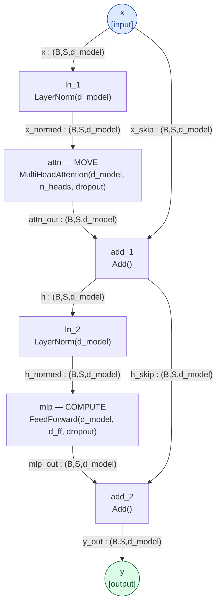
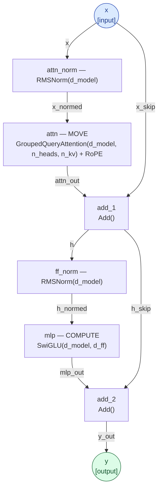
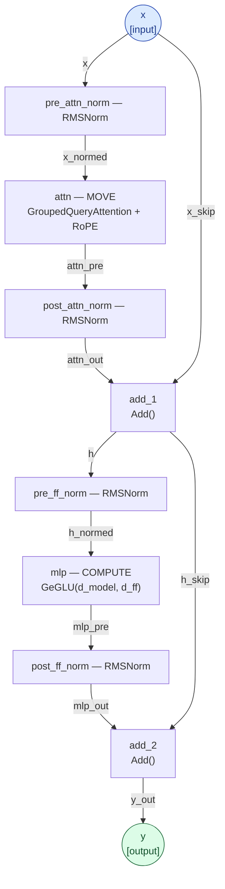
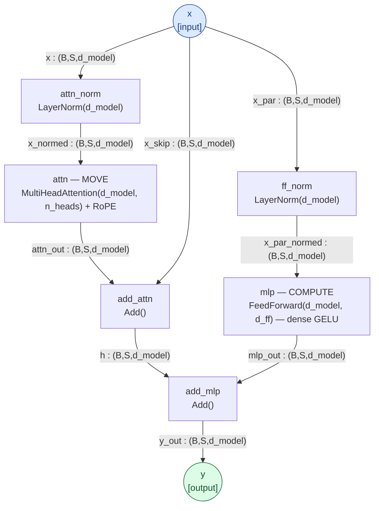
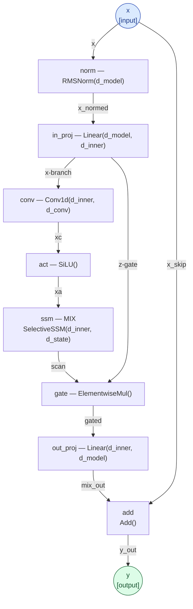
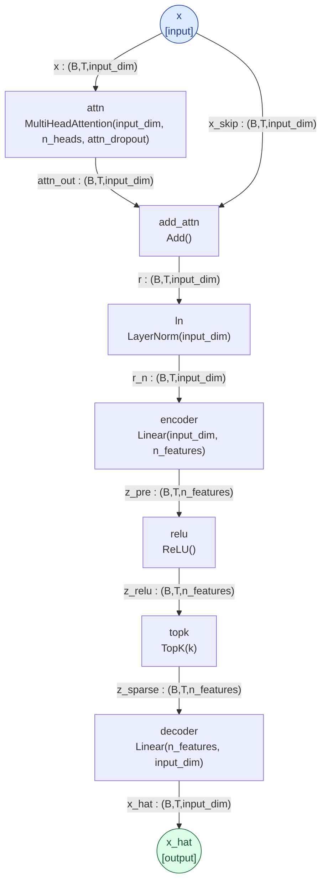

# Architecture references (n-orca diagrams)

The architectures this project studies, declared as typed-DAG specs in
[**n-orca**](https://github.com/jascal/n-orca) (a Markdown DSL for neural-net architectures that *verifies*
shapes/types and compiles to Mermaid / runnable PyTorch) and rendered here. These are *reference* diagrams — the
hosts we disassemble, plus the SAE the forge-tax sister track acts on — not results. One block per architecture
**family** (models within a family differ only in dims):

- **GPT-2** (small / medium / large) — absolute position, LayerNorm, dense MLP.
- **RoPE family** (Llama-3.2-1B, Qwen-2.5-1.5B) — RoPE, grouped-query attention, RMSNorm, SwiGLU.
- **Gemma-2-2B** — the RoPE outlier: sandwich (pre+post) norm, GeGLU; no sink, distributed COMPUTE.
- **GPT-NeoX** (Pythia 14m → 1.4b) — rotary position, LayerNorm, dense GELU, **parallel residual**; the controlled
  scaling ladder (one architecture, same data, six sizes).
- **Mamba** (130m / 370m / 790m) — state-space mixer, no attention, no separate MLP.

## GPT-2 block — the host the catalog disassembles

One pre-norm GPT-2-small block. **Attention is the MOVE class** (a QK addressing-mode × an OV write-op — the heads
the [operator catalog](operators/README.md) reads); **the MLP is the COMPUTE class** (key–value memories — the
[MLP / COMPUTE catalog](operators/mlp_compute.md); `mlp` at layer 0 is the detokenizer). Verified by n-orca:
**VALID, 7.09M params/block, depth 7.** Spec:
[`docs/specs/gpt2_block.n.orca.md`](https://github.com/jascal/lm-sae/blob/main/docs/specs/gpt2_block.n.orca.md).

The residual stream `x → … → y` is the **bus**; each block reads it (LayerNorm), MOVES (attention) and COMPUTES
(MLP), and writes back (Add). The disassembly reads the operators *inside* the `attn` and `mlp` nodes.
(GPT-2 small/medium/large share this block; they differ only in dims — 768/1024/1280 d_model, 12/16/20 heads.)

## RoPE block — the Llama / Qwen family

Same MOVE+COMPUTE skeleton, but pre-**RMSNorm**, **grouped-query** attention with **rotary positions**, and a
**SwiGLU** gated MLP (no biases). Position lives in the *rotation*, so there is no learned absolute-position
register — and (as the [circuit catalog](circuits/README.md) finds) no positional-broadcast circuit and no
attention sink dependence. Dims: Llama-3.2-1B (2048 / 32 heads / 8 kv / 8192); Qwen-2.5-1.5B (1536 / 12 / 2 / 8960).
Spec: [`docs/specs/rope_block.n.orca.md`](https://github.com/jascal/lm-sae/blob/main/docs/specs/rope_block.n.orca.md).

## Gemma-2 block — the architectural outlier

Gemma-2-2B is RoPE+GQA like Llama/Qwen but wraps **each** sublayer in **both** a pre- and a post-RMSNorm (a
sandwich norm) and uses a **GeGLU** MLP. It is the outlier in the catalog: **no attention sink** (0 sink heads vs
117–553 elsewhere) and **distributed COMPUTE** (no single dominant detokenizer MLP). Dims for Gemma-2-2B
(2304 / 8 heads / 4 kv / 9216). Spec:
[`docs/specs/gemma_block.n.orca.md`](https://github.com/jascal/lm-sae/blob/main/docs/specs/gemma_block.n.orca.md).

## GPT-NeoX block — the controlled scaling ladder (Pythia)

The **Pythia** ladder (EleutherAI, 14m → 1.4b) is **one GPT-NeoX architecture at six sizes trained on the same data**
— the clean control behind the [scaling laws](scaling.md) (architecture held fixed). The block keeps GPT-2's
**LayerNorm** and **dense GELU** MLP but takes position from a **rotary** embedding (like the RoPE family), with
standard multi-head attention (no GQA). Its one distinctive feature is the **parallel residual**: attention and MLP
both read the *block input* `x` (each through its own LayerNorm) and are summed into the residual *together* —
`y = x + attn(ln_a x) + mlp(ln_m x)` — rather than the serial attention-*then*-MLP of GPT-2 / RoPE / Gemma. Same
MOVE (attention) + COMPUTE (MLP) split, so the arch-generic disassembly (logit-lens read-out, block ablation,
knowledge READ/WRITE) runs on it directly. Verified by n-orca: **VALID, 12.60M params/block (Pythia-410m dims),
depth 5.** Spec: [`specs/gpt_neox_block.n.orca.md`](https://github.com/jascal/lm-sae/blob/main/specs/gpt_neox_block.n.orca.md).

Note `x` fans out to **both** `attn_norm` and `ff_norm` (the parallel residual): the MLP reads the block input, not
the post-attention residual. The disassembly reads the operators inside `attn` and `mlp` exactly as in the other
families. (Pythia sizes scale `d_model`/`n_layers`: 14m d128/6L · 70m d512/6L · 160m d768/12L · 410m d1024/24L ·
1b d2048/16L · 1.4b d2048/24L.)

## Mamba block — the no-attention control (SSM)

Mamba (130m/370m/790m) has **no attention and no separate MLP**: the whole layer is one selective **state-space
mixer** (a learned linear recurrence / scan). The catalog's SSM result: the in-context-copy *capability*
(induction) survives this loss of attention (gain +12.1…+12.5, like the transformers) — but with no heads there is
no head-resolved operator, only a layer. Dims for Mamba-130m (d_model 768, d_inner 1536, d_state 16). Spec:
[`docs/specs/mamba_block.n.orca.md`](https://github.com/jascal/lm-sae/blob/main/docs/specs/mamba_block.n.orca.md).

## Sparse autoencoder — the forge-tax tool (sister track)

A top-K SAE (with an attention pre-mixer): encode the residual into sparse `n_features`, keep the top-K, decode
back. This is the dictionary the [forge-tax track](FORGE_TAX_TRACK.md) measures — *what an SAE feature basis
preserves vs destroys* (it preserves content/mAUC but collapses monosemanticity/cov95). Spec:
[`docs/specs/sae_attn_topk.n.orca.md`](https://github.com/jascal/lm-sae/blob/main/docs/specs/sae_attn_topk.n.orca.md).

---

_Diagrams compiled from the committed `.n.orca.md` specs with
[n-orca](https://github.com/jascal/n-orca): `n-orca compile mermaid docs/specs/<spec>.n.orca.md`. Rendered on the
site via mermaid.js._
