# Architecture references (n-orca diagrams)

The architectures this project studies, declared as typed-DAG specs in
[**n-orca**](https://github.com/jascal/n-orca) (a Markdown DSL for neural-net architectures that *verifies*
shapes/types and compiles to Mermaid / runnable PyTorch) and rendered here. These are *reference* diagrams — the
hosts we disassemble, plus the SAE the forge-tax sister track acts on — not results. One block per architecture
**family** (models within a family differ only in dims):

- **GPT-2** (small / medium / large) — absolute position, LayerNorm, dense MLP.
- **RoPE family** (Llama-3.2-1B, Qwen-2.5-1.5B) — RoPE, grouped-query attention, RMSNorm, SwiGLU.
- **Gemma-2-2B** — the RoPE outlier: sandwich (pre+post) norm, GeGLU; no sink, distributed COMPUTE.
- **GPT-NeoX** (Pythia 14m → 1.4b) — rotary position, LayerNorm, dense GELU, **parallel residual**; the controlled
  scaling ladder (one architecture, same data, six sizes).
- **Mamba** (130m / 370m / 790m) — state-space mixer, no attention, no separate MLP.

Plus the **frontier families the [fieldrun](https://github.com/jascal/fieldrun) runtime executes** (the
distribution form of the pylm decompilation; each kernel validated top-1 vs a torch reference):

- **Gemma-3** — Gemma-2's sandwich skeleton + QK-norm (replacing the soft-cap) + dual-base RoPE, 5:1 sliding:full.
- **Gemma-4** — + value-norm, per-layer-type head_dim, partial-rotary global RoPE, and the Per-Layer-Embedding
  gated residual (dense and MoE variants).
- **Qwen3-MoE** — the RoPE backbone + per-head QK-norm + a softmax-routed sparse-expert FFN (optional all-layer
  sliding window).
- **MLA** (DeepSeek-V3/R1, Kimi-K2) — multi-head *latent* attention (low-rank q/kv, shared rope key, YaRN) +
  shared-expert / group-limited sigmoid MoE.
- **MiniMax-M2** — full-width q/k-norm + an all-MoE sigmoid-routed FFN on every layer.

## GPT-2 block — the host the catalog disassembles

One pre-norm GPT-2-small block. **Attention is the MOVE class** (a QK addressing-mode × an OV write-op — the heads
the [operator catalog](operators/README.md) reads); **the MLP is the COMPUTE class** (key–value memories — the
[MLP / COMPUTE catalog](operators/mlp_compute.md); `mlp` at layer 0 is the detokenizer). Verified by n-orca:
**VALID, 7.09M params/block, depth 7.** Spec:
[`docs/specs/gpt2_block.n.orca.md`](https://github.com/jascal/lm-sae/blob/main/docs/specs/gpt2_block.n.orca.md).

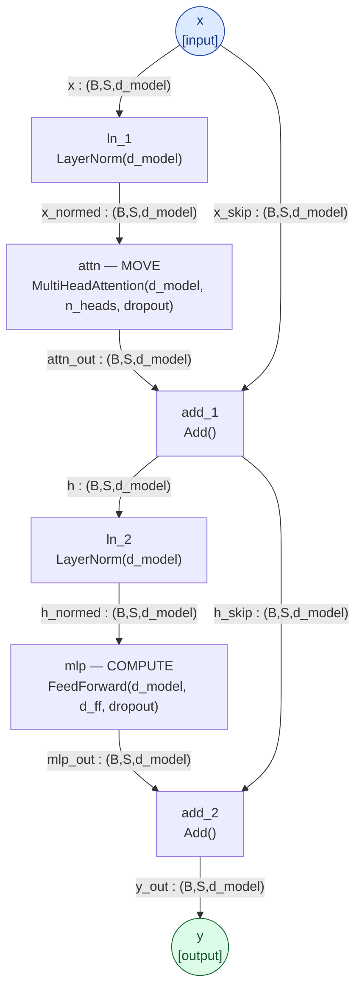

The residual stream `x → … → y` is the **bus**; each block reads it (LayerNorm), MOVES (attention) and COMPUTES
(MLP), and writes back (Add). The disassembly reads the operators *inside* the `attn` and `mlp` nodes.
(GPT-2 small/medium/large share this block; they differ only in dims — 768/1024/1280 d_model, 12/16/20 heads.)

## RoPE block — the Llama / Qwen family

Same MOVE+COMPUTE skeleton, but pre-**RMSNorm**, **grouped-query** attention with **rotary positions**, and a
**SwiGLU** gated MLP (no biases). Position lives in the *rotation*, so there is no learned absolute-position
register — and (as the [circuit catalog](circuits/README.md) finds) no positional-broadcast circuit and no
attention sink dependence. Dims: Llama-3.2-1B (2048 / 32 heads / 8 kv / 8192); Qwen-2.5-1.5B (1536 / 12 / 2 / 8960).
Spec: [`docs/specs/rope_block.n.orca.md`](https://github.com/jascal/lm-sae/blob/main/docs/specs/rope_block.n.orca.md).

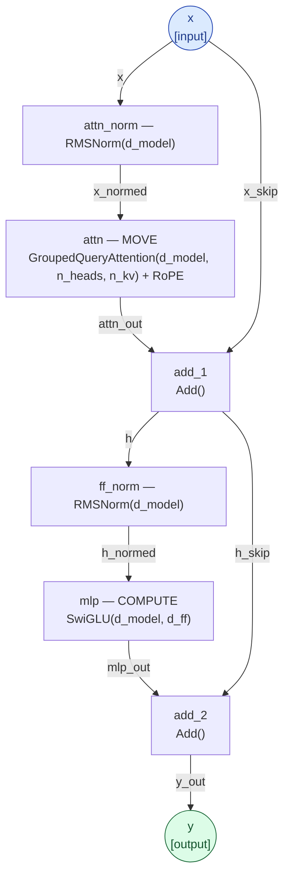

## Gemma-2 block — the architectural outlier

Gemma-2-2B is RoPE+GQA like Llama/Qwen but wraps **each** sublayer in **both** a pre- and a post-RMSNorm (a
sandwich norm) and uses a **GeGLU** MLP. It is the outlier in the catalog: **no attention sink** (0 sink heads vs
117–553 elsewhere) and **distributed COMPUTE** (no single dominant detokenizer MLP). Dims for Gemma-2-2B
(2304 / 8 heads / 4 kv / 9216). Spec:
[`docs/specs/gemma_block.n.orca.md`](https://github.com/jascal/lm-sae/blob/main/docs/specs/gemma_block.n.orca.md).

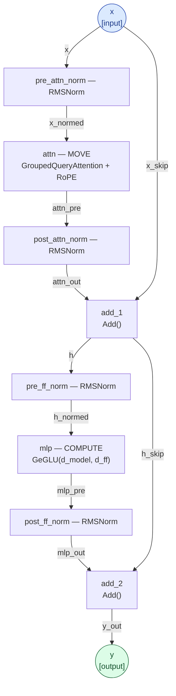

## GPT-NeoX block — the controlled scaling ladder (Pythia)

The **Pythia** ladder (EleutherAI, 14m → 1.4b) is **one GPT-NeoX architecture at six sizes trained on the same data**
— the clean control behind the [scaling laws](scaling.md) (architecture held fixed). The block keeps GPT-2's
**LayerNorm** and **dense GELU** MLP but takes position from a **rotary** embedding (like the RoPE family), with
standard multi-head attention (no GQA). Its one distinctive feature is the **parallel residual**: attention and MLP
both read the *block input* `x` (each through its own LayerNorm) and are summed into the residual *together* —
`y = x + attn(ln_a x) + mlp(ln_m x)` — rather than the serial attention-*then*-MLP of GPT-2 / RoPE / Gemma. Same
MOVE (attention) + COMPUTE (MLP) split, so the arch-generic disassembly (logit-lens read-out, block ablation,
knowledge READ/WRITE) runs on it directly. Verified by n-orca: **VALID, 12.60M params/block (Pythia-410m dims),
depth 5.** Spec: [`specs/gpt_neox_block.n.orca.md`](https://github.com/jascal/lm-sae/blob/main/specs/gpt_neox_block.n.orca.md).

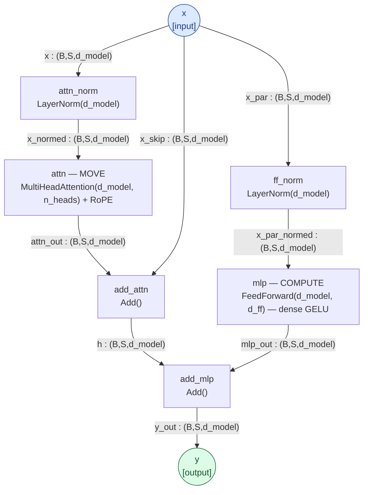

Note `x` fans out to **both** `attn_norm` and `ff_norm` (the parallel residual): the MLP reads the block input, not
the post-attention residual. The disassembly reads the operators inside `attn` and `mlp` exactly as in the other
families. (Pythia sizes scale `d_model`/`n_layers`: 14m d128/6L · 70m d512/6L · 160m d768/12L · 410m d1024/24L ·
1b d2048/16L · 1.4b d2048/24L.)

## Mamba block — the no-attention control (SSM)

Mamba (130m/370m/790m) has **no attention and no separate MLP**: the whole layer is one selective **state-space
mixer** (a learned linear recurrence / scan). The catalog's SSM result: the in-context-copy *capability*
(induction) survives this loss of attention (gain +12.1…+12.5, like the transformers) — but with no heads there is
no head-resolved operator, only a layer. Dims for Mamba-130m (d_model 768, d_inner 1536, d_state 16). Spec:
[`docs/specs/mamba_block.n.orca.md`](https://github.com/jascal/lm-sae/blob/main/docs/specs/mamba_block.n.orca.md).

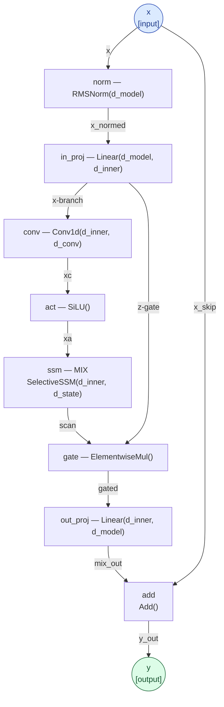

## Gemma-3 block — QK-norm + dual-base RoPE

The Gemma-2 sandwich-norm skeleton with the two changes that define Gemma 3: **QK-norm** (a per-head RMSNorm on
q/k *before* RoPE — it replaces Gemma-2's attention-logit soft-cap, so the attention is expanded here to show where
it sits) and **dual-base RoPE** (sliding/local layers rotate at θ≈10k, full/global at θ≈1M) over a **5:1
sliding:full** layer pattern. No soft-capping anywhere. Same MOVE (attention) + COMPUTE (GeGLU MLP) split. Dims for
the Gemma-3 reference config (d_model 2304, 8 heads / 4 kv, head_dim 256 ≠ d_model/n_heads, d_ff 9216). Verified by
n-orca: **VALID, depth 13.** Spec:
[`docs/specs/gemma3_block.n.orca.md`](https://github.com/jascal/lm-sae/blob/main/docs/specs/gemma3_block.n.orca.md).

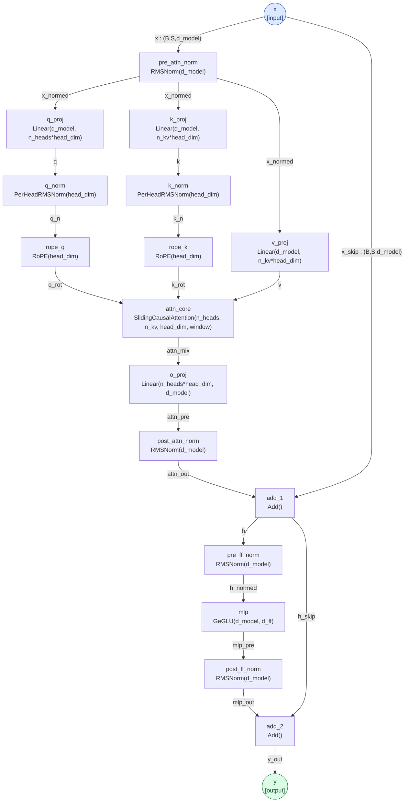

## Gemma-4 block — value-norm + Per-Layer Embeddings

The Gemma-3 backbone plus Gemma 4's changes: a **value-norm** (per-head RMS on v, no learnable weight) beside the
q/k norms, attention **scaling = 1.0**, a **different head_dim on global layers** (512 vs 256), **partial-rotary**
RoPE on global layers (only the first ¼ of frequency pairs rotate), and — the structural novelty — the
**Per-Layer-Embedding (PLE) gated-residual block**: a per-layer token-identity embedding, gated by the post-FFN
hidden (GELU of a d→d_ple projection), projected back to the residual through its own norm. The MoE variant
(26B-A4B) sums a routed top-k expert branch with the dense MLP. Dims for the Gemma-4 reference config (d_model 2304,
8 heads / 4 kv, head_dim 256/512, d_ple 256). Verified by n-orca: **VALID, depth 14.** Spec:
[`docs/specs/gemma4_block.n.orca.md`](https://github.com/jascal/lm-sae/blob/main/docs/specs/gemma4_block.n.orca.md).

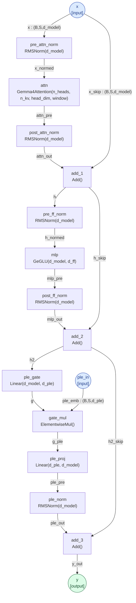

## Qwen3-MoE block — softmax-routed sparse experts

The RoPE backbone (pre-RMSNorm, GQA, single-base rotary, no attention bias) + per-head QK-norm, with the FFN
replaced by a **sparse MoE**: a plain-gate router (softmax over all experts → top-k → renorm) over per-expert SwiGLU
MLPs — only each token's top-k experts run (in fieldrun they page in from an mmap, so the resident set is the shared
layers + hot experts, not the whole model). Optional **sliding window** applies one window to *every* layer (no
per-layer pattern, unlike Gemma). The MOVE class is unchanged; the COMPUTE class becomes *conditional* — which
expert computes is input-dependent. Dims for the Qwen3-MoE reference config (30B-A3B-class: d_model 2048, 32 heads /
4 kv, 128 experts, top-8, d_expert 768). Verified by n-orca: **VALID, depth 8.** Spec:
[`docs/specs/qwen3moe_block.n.orca.md`](https://github.com/jascal/lm-sae/blob/main/docs/specs/qwen3moe_block.n.orca.md).

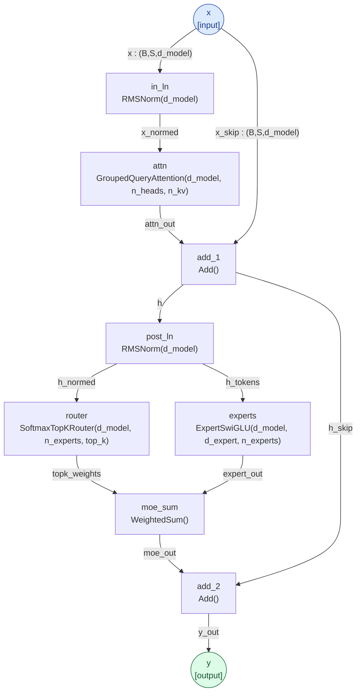

## MLA block — DeepSeek-V3 / Kimi-K2 latent attention

**Multi-head latent attention**, the last new attention class in the supported set: q and kv are compressed
through low-rank latents (q: d → 1536 → per-head [no-RoPE 128 ‖ RoPE 64]; kv: one projection to [512-dim latent ‖
64-dim rope slice], the latent expanded per head to [k_nope ‖ v]). The rope slice of the key is a **single shared
vector** (MQA-style) broadcast to all 128 heads; v_head_dim (128) ≠ qk_head_dim (192). Rotary is **YaRN**-scaled
(ramp-blended inv_freq, mscale attention factor, mscale² softmax correction) in DeepSeek's **interleaved** layout.
The MoE adds an always-on **shared expert** to **group-limited sigmoid routing** (bias-corrected scores *choose* the
experts, un-biased scores *weight* them); the first `first_k_dense_replace` layers are dense. Dims for the
DeepSeek-V3 reference config (671B-A37B-class: d_model 7168, 128 heads, 256 routed experts top-8 from 4 of 8
groups). Verified by n-orca: **VALID, depth 14.** Spec:
[`docs/specs/mla_block.n.orca.md`](https://github.com/jascal/lm-sae/blob/main/docs/specs/mla_block.n.orca.md).

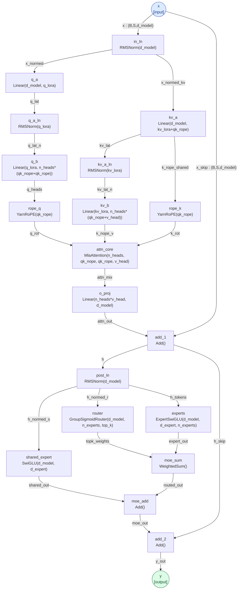

## MiniMax-M2 block — full-width q/k-norm, all-MoE

The RoPE backbone with two distinctive choices: **full-width q/k-norm** — one RMSNorm over the *whole*
concatenated projection (n_heads·head_dim for q, n_kv·head_dim for k), not per-head like Qwen3/Gemma — and an
**all-MoE FFN on every layer** with a **sigmoid router** (sigmoid scores + a learned bias choose the top-k; the
un-biased scores, renormed, weight them). No group limiting, no shared expert, no dense layers — the leanest of the
frontier-MoE recipes. Dims for the MiniMax-M2 reference config (230B-A10B-class: d_model 3072, 48 heads / 8 kv, 256
experts, top-8, d_expert 1536). Verified by n-orca: **VALID, depth 12.** Spec:
[`docs/specs/minimax_block.n.orca.md`](https://github.com/jascal/lm-sae/blob/main/docs/specs/minimax_block.n.orca.md).

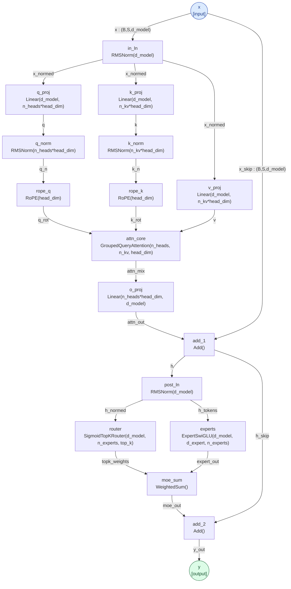

## DeepSeek-V4 block — mHC hyper-connections + shared-KV-MQA + sink

A **new attention class**, not MLA. The residual is `hc_mult` parallel streams kept through the whole block and mixed by
two **manifold-constrained hyper-connections (mHC)**: each `attn_hc`/`ffn_hc` collapses the streams into one sequence (a
`pre`-weighted sum) for the sublayer, and the update re-places the output with a `post` gate plus a **Sinkhorn-projected
doubly-stochastic** `comb` mix back across the streams. Attention is **shared-KV MQA** (one KV head, read as both K and
V) with **q-LoRA** queries, **partial interleaved RoPE**, a per-head **attention sink** (an extra softmax logit dropped
from the output), an **undo-RoPE** conjugate rotation on the output (because K==V), and a **grouped low-rank o_proj**. The
FFN is a **sqrtsoftplus** MoE (`softplus(logits).sqrt()` scores; a learned bias picks the top-k; un-biased scores renorm ×
scale weight them) plus an always-on **shared expert**, both with gpt-oss SwiGLU clamps. Dims for the V4-Flash reference
(d_model 4096, 64 heads, head_dim 512, q_lora 1024, 256 experts, top-6, d_expert 2048, hc_mult 4). Verified by n-orca:
**VALID, depth 19.** fieldrun's `dsv4` kernel matches `DeepseekV4ForCausalLM` **60/60 top-1** (Stage 1: the sliding-only
backbone; the CSA/HCA compressors + Lightning Indexer are separate regimes). Spec:
[`docs/specs/dsv4_block.n.orca.md`](https://github.com/jascal/lm-sae/blob/main/docs/specs/dsv4_block.n.orca.md).

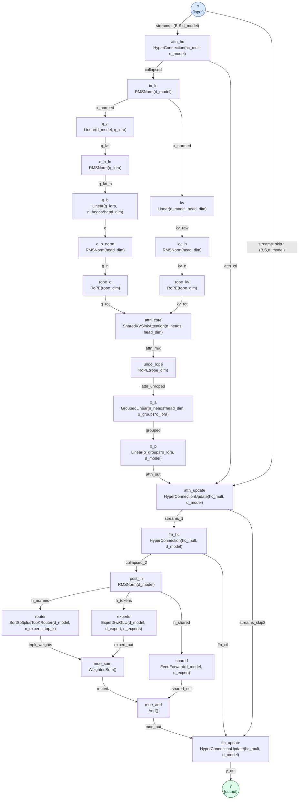

## Sparse autoencoder — the forge-tax tool (sister track)

A top-K SAE (with an attention pre-mixer): encode the residual into sparse `n_features`, keep the top-K, decode
back. This is the dictionary the [forge-tax track](FORGE_TAX_TRACK.md) measures — *what an SAE feature basis
preserves vs destroys* (it preserves content/mAUC but collapses monosemanticity/cov95). Spec:
[`docs/specs/sae_attn_topk.n.orca.md`](https://github.com/jascal/lm-sae/blob/main/docs/specs/sae_attn_topk.n.orca.md).

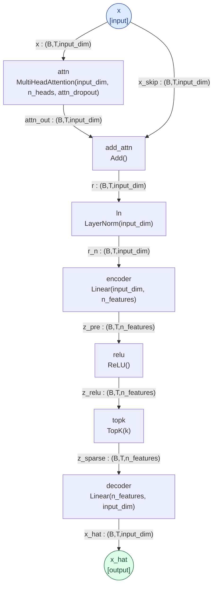

---

_Diagrams compiled from the committed `.n.orca.md` specs with
[n-orca](https://github.com/jascal/n-orca): `n-orca compile mermaid docs/specs/<spec>.n.orca.md`. Rendered on the
site via mermaid.js._
