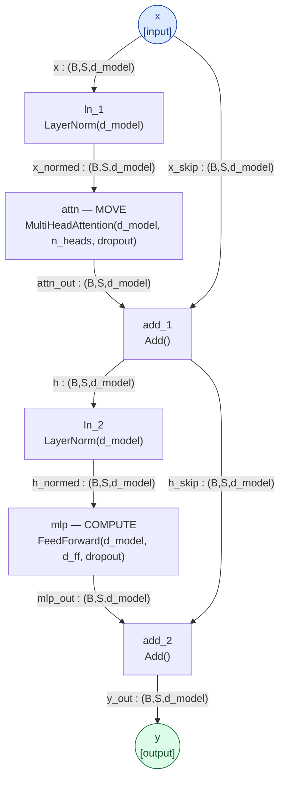
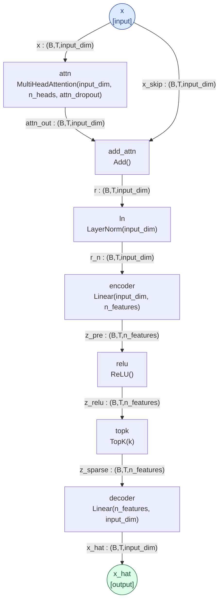

# Architecture references (n-orca diagrams)

The architectures this project studies, declared as typed-DAG specs in
[**n-orca**](https://github.com/jascal/n-orca) (a Markdown DSL for neural-net architectures that *verifies*
shapes/types and compiles to Mermaid / runnable PyTorch) and rendered here. These are *reference* diagrams — the
host we disassemble, and the SAE the forge-tax sister track acts on — not results.

## GPT-2 block — the host the catalog disassembles

One pre-norm GPT-2-small block. **Attention is the MOVE class** (a QK addressing-mode × an OV write-op — the heads
the [operator catalog](operators/README.md) reads); **the MLP is the COMPUTE class** (key–value memories — the
[MLP / COMPUTE catalog](operators/mlp_compute.md); `mlp` at layer 0 is the detokenizer). Verified by n-orca:
**VALID, 7.09M params/block, depth 7.** Spec:
[`docs/specs/gpt2_block.n.orca.md`](https://github.com/jascal/lm-sae/blob/main/docs/specs/gpt2_block.n.orca.md).

The residual stream `x → … → y` is the **bus**; each block reads it (LayerNorm), MOVES (attention) and COMPUTES
(MLP), and writes back (Add). The disassembly reads the operators *inside* the `attn` and `mlp` nodes.

## Sparse autoencoder — the forge-tax tool (sister track)

A top-K SAE (with an attention pre-mixer): encode the residual into sparse `n_features`, keep the top-K, decode
back. This is the dictionary the [forge-tax track](FORGE_TAX_TRACK.md) measures — *what an SAE feature basis
preserves vs destroys* (it preserves content/mAUC but collapses monosemanticity/cov95). Spec:
[`docs/specs/sae_attn_topk.n.orca.md`](https://github.com/jascal/lm-sae/blob/main/docs/specs/sae_attn_topk.n.orca.md).

---

_Diagrams compiled from the committed `.n.orca.md` specs with
[n-orca](https://github.com/jascal/n-orca): `n-orca compile mermaid docs/specs/<spec>.n.orca.md`. Rendered on the
site via mermaid.js._
